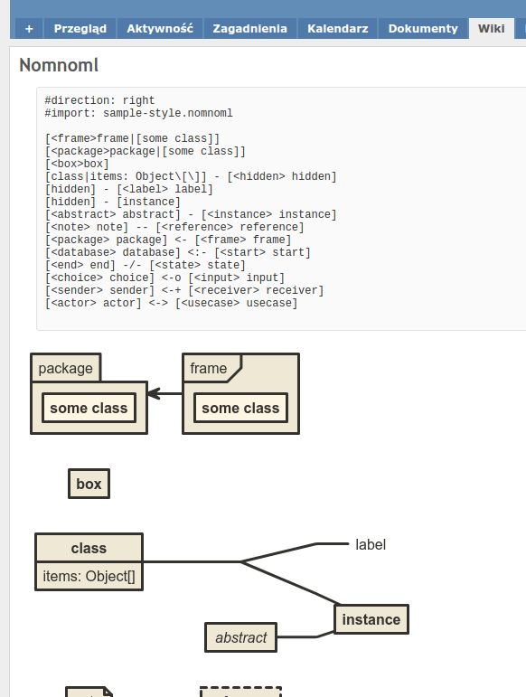
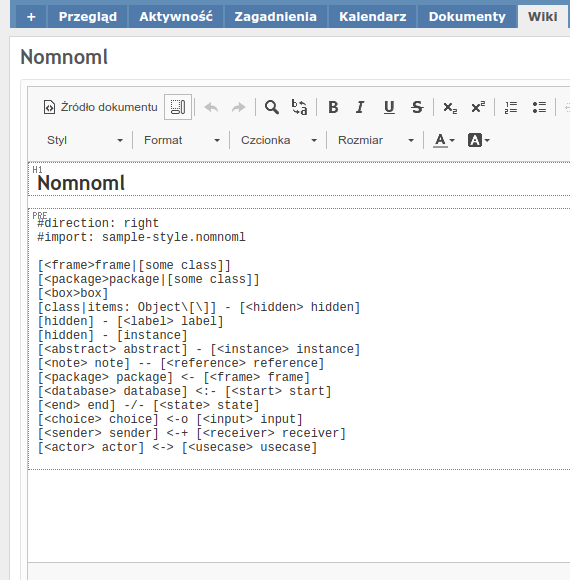

# Redmine Nomnoml Macro Plugin

This plugin adds a `nomnoml` graph macro to wiki formated fields. 

About nomnoml: https://github.com/skanaar/nomnoml

## Example




## Installation

1. Clone or copy files into the Redmine plugins directory
   ```
   git clone https://github.com/m32/redmine_nomnoml_macro.git plugins/redmine_nomnoml_macro
   ```
2. Restart Redmine

## License

[MIT](LICENSE)
